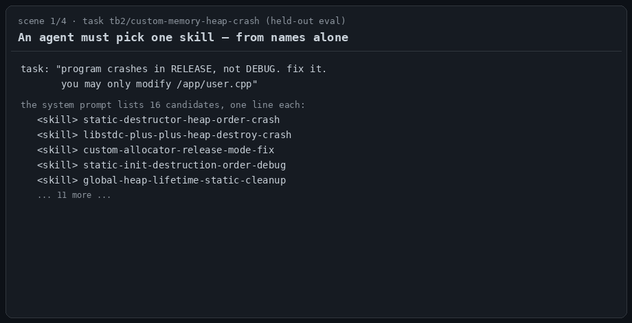
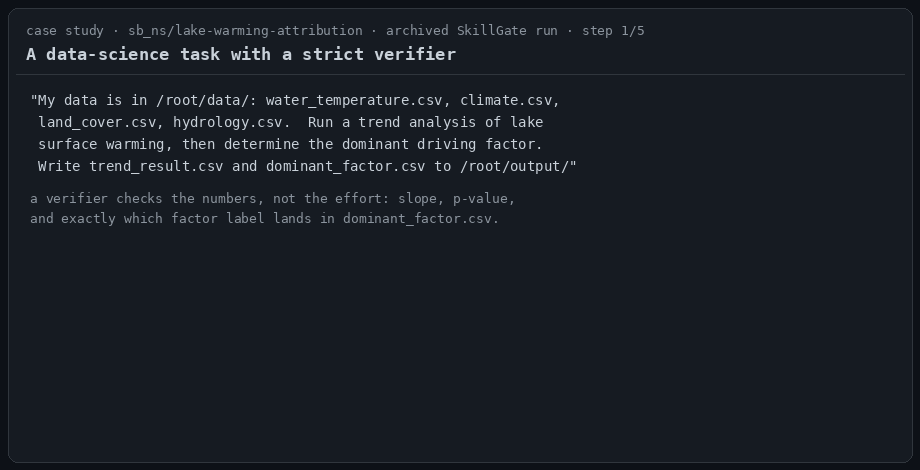
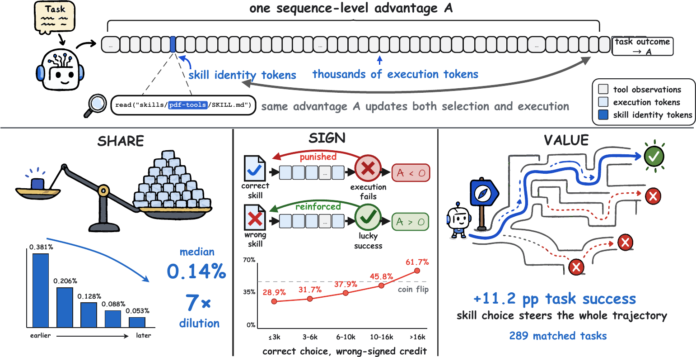
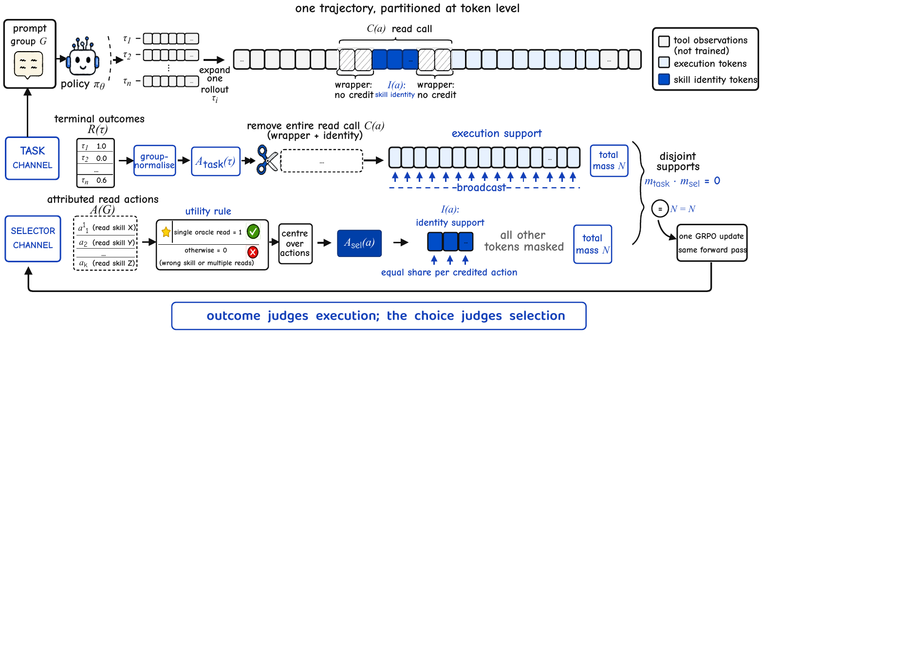

<div align="center">

# SkillGate

### Training In-Policy Skill Selection in Long-Horizon Agents

[](#installation)
[](THIRD_PARTY.md)
[](https://huggingface.co/simonlqy/SkillGate-9B)
<!-- [](https://arxiv.org/abs/XXXX.XXXXX) -->

[Demo](#-demo) · [Overview](#overview) · [Highlights](#highlights) · [Results](#results) ·
[Model](#model) · [Layout](#repository-layout) · [Installation](#installation) ·
[Evaluation](#evaluation) · [Training](#training) · [Citation](#citation)

</div>

---

Agent skills are instruction files an agent reads on demand: a name, a one-line
description, a body of procedure. With thousands in a library, **which skill to
read is a decision the policy makes mid-episode** — from names and descriptions
alone — and outcome-rewarded RL cannot teach it. The tokens that name the chosen
skill carry a median **0.14%** of their trajectory's loss weight, and two in five
receive a *negative* advantage because execution afterwards failed. We call this
**selector credit starvation**. SkillGate removes it by construction: one GRPO
update, two disjoint credit channels — outcome credit reaches only execution
tokens, while an action-local advantage reaches exactly the skill-naming tokens,
positive only when the trajectory's single read is the correct skill.

## 🎬 Demo

### The problem and the fix, in 30 seconds

<p align="center"></p>

Four scenes, no mock data. A held-out task where the whole decision is **8
tokens** inside a read call; the failing run in which those tokens are **11 of
30,487** — 0.036% of the loss, counted with the released tokenizer over the
archived trajectory; the credit partition SkillGate applies instead; and what
that one change buys on the same task pair.

### Case study: one SkillGate episode, end to end

<p align="center"></p>

An archived run on `sb_ns/lake-warming-attribution` (verifier-checked data
analysis). The policy starts working, reaches for the library **mid-episode**,
picks the oracle out of six lake/trend lookalikes in one read, and lands the two
traps the skill documents (Mann-Kendall instead of `linregress`; the *category*
label `Heat`, not the individual driver). Score 1.0 in 14 tool calls — on the
same slate, the outcome-only baseline read four skills, none of them the oracle,
and failed.

## Overview

**The problem** — one broadcast advantage updates both the few tokens that chose
a skill and the thousands that executed the task. Auditing 12,800 training
trajectories shows the choice's share dilutes to a 0.14% median (*Share*), its
credit is increasingly wrong-signed with horizon (*Sign*), yet the correct read
is worth +11.2 pp task success (*Value*):

<p align="center"></p>

**The fix** — SkillGate partitions the token support of a single GRPO update:

<p align="center"></p>

One trajectory contains two different kinds of decisions, settled by different
evidence:

| | settled by | credited by |
|---|---|---|
| **Selection** — which `SKILL.md` to read | the slate alone | action-local advantage on the skill-identity tokens, +1 only for a clean single-oracle read, centred over the group's read actions |
| **Execution** — everything after | the task outcome | group-normalised outcome advantage; the entire read call is deleted from the task loss |

The two channels partition the token support of a single GRPO update (equal loss
mass per channel, selector coefficient λ = 0.20). No reward shaping, no extra
models, no inference-time scaffolding: at deployment the policy is a plain agent.

## Highlights

- **The problem is measured, not asserted** — auditing 12,800 training
  trajectories shows the choice's loss share dilutes 7× with length (*Share*),
  its credit is increasingly wrong-signed as trajectories lengthen (*Sign*), yet
  matched prompt groups put the correct read at **+11.2 pp** task success (*Value*).
- **One change, isolated** — SkillGate and the outcome-only baseline share the
  same base model, SFT init, data, steps and hyperparameters; only the tokens the
  gradient reaches differ.
- **53.2% trial success** on five agentic benchmarks at 9B — best in its scale
  band, ahead of outcome-only RL at 47.0%.
- **Selection you can see** — oracle-skill reads 54.3% → **83.9%**, misleading
  reads 69.6% → **21.8%**, while reading *fewer* skills per trial.
- **Deploy-real prompts** — training and evaluation run under a byte-aligned
  OpenClaw-style system prompt and tool schema, so the trained policy drops into
  a real agent runtime unchanged.

## Results

Trial success (%) on the standard mixed 16-candidate slate, 385-trial protocol
(SkillsBench / SETA / SWE / Terminal-Bench 2.0 / Claw-Eval; Claw is fully
held-out from training):

| Method | Claw | SB | SETA | SWE | TB2 | **Overall** | Oracle ↑ | Mislead. ↓ |
|---|---:|---:|---:|---:|---:|---:|---:|---:|
| Qwen3.5-9B (base) | 44.7 | 0.0 | 24.2 | 15.0 | 9.4 | 28.6 | 5.7 | 8.9 |
| SFT (RL init) | 50.9 | 6.2 | 40.0 | 45.0 | 21.9 | 40.8 | 37.9 | 61.8 |
| Selection BC | 52.2 | 15.6 | 43.3 | 50.0 | 34.4 | 44.7 | 71.4 | 31.4 |
| SelSkill-DPO | 52.8 | 0.0 | 47.5 | 60.0 | 37.5 | 46.2 | 66.1 | 51.8 |
| Skill-free RL | 55.9 | 9.4 | 47.5 | 42.5 | 31.2 | 46.0 | 35.4 | 55.0 |
| SkillRL (outcome reward) | 57.1 | 3.1 | 50.0 | 45.0 | 31.2 | 47.0 | 54.3 | 69.6 |
| Skill1 | 57.1 | 9.4 | 38.3 | 52.5 | 31.2 | 44.7 | 53.5 | 45.5 |
| **SkillGate** | **60.2** | **15.6** | **54.2** | **65.0** | **37.5** | **53.2** | **83.9** | **21.8** |

Read-behaviour columns are the fraction of trials reading at least one
oracle/misleading skill (280-trial repeated protocol). Full tables, the frontier
reference rows, ablations and the 147-task held-out Claw split are in the paper.

## Model

| | |
|---|---|
| Weights | [`simonlqy/SkillGate-9B`](https://huggingface.co/simonlqy/SkillGate-9B) — final RL checkpoint (iter 99) behind every SkillGate number above |
| Base | Qwen3.5-9B |
| Recipe | 100 steps on-policy GRPO, 491 tasks, 8 rollouts/prompt, lr 1e-6, KL β 3e-5, selector λ 0.20 |

```python
from transformers import AutoModelForCausalLM, AutoTokenizer
tok = AutoTokenizer.from_pretrained("simonlqy/SkillGate-9B")
model = AutoModelForCausalLM.from_pretrained("simonlqy/SkillGate-9B", torch_dtype="bfloat16")
```

The model expects the OpenClaw-style prompt profile it was trained with
(`GeneralAgent/eval_scripts/unified_runner/openclaw_compat.py` builds it; the
paper's appendix reproduces it verbatim).

## Repository layout

First-party code (the paper lives here):

| Path | What |
|---|---|
| `Relax/examples/agent_bench/` | **The method**: `selector_clean_oracle_action_credit.py` (clean-oracle utility), `selector_action_credit.py` (identity-span detection + token-local advantage), `selector_action_grpo_loss.py` (two-channel GRPO loss) |
| `ops/workflows/rl_training/` | RL launchers; the paper's profile is `profiles/selector_clean_oracle_action_credit.sh` |
| `ops/workflows/rl_eval/` | Frozen 385/280-trial evaluation protocol and analysis |
| `GeneralAgent/eval_scripts/unified_runner/` | 5-benchmark agent environment, OpenClaw-aligned prompts/tools |
| `GeneralAgent/sft_*` | SFT data collection and training (LLaMA-Factory) |
| `skill_libraries/` | Slate construction and merge manifests |
| `ops/recipes/catalog.toml` + `./skillrl` | Operator CLI over all of the above |
| `docs/OPERATIONS_GUIDE.md` | End-to-end running manual |

Vendored third-party trees (`Relax/`, `sglang/`, `Megatron-LM/`, `slime/`,
`GeneralAgent/third_party/LLaMA-Factory/`) are pinned and licensed per
[THIRD_PARTY.md](THIRD_PARTY.md).

## Installation

```bash
git clone https://github.com/SIMONLQY/SkillGate
cd SkillGate
cp .env.example .env          # fill in W&B key etc.; see comments inside

# Three separate Python 3.12 stacks (never mix their PYTHONPATHs):
#   slime  — eval, serving, SFT collection    env/freezes/slime_env_pipfreeze_*.txt
#   relax  — RL training                      Relax/requirements
#   llamafactory — SFT                        GeneralAgent/third_party/LLaMA-Factory
# See env/README.md for the exact builds.

./skillrl doctor              # validate wiring (no GPU needed)
./skillrl recipes             # list every maintained entrypoint
```

Datasets, frozen skill snapshots and cached verifier payloads ship as a side-car
asset bundle outside Git (`assets/README.md`; integrity via
`assets/migrated-assets.json`).

## Evaluation

```bash
# canonical eval: 5 benchmarks, frozen slate snapshot, owner-aware rows
./skillrl show eval.eval70-checkpoint-set          # see arguments
./skillrl run  eval.eval70-checkpoint-set -- --group <row-spec>   # add --execute to run

# per-category read attribution (oracle / misleading / relevant / irrelevant)
python ops/workflows/rl_eval/analyze_slate_reads.py --row <row-dir>
```

Every trial runs the same frozen slate snapshot, prompt profile, decoding seed
and grader; `docs/OPERATIONS_GUIDE.md` §9 documents the protocol.

## Training

```bash
# 1) SFT init (LoRA on collected teacher trajectories)
./skillrl run sft.final-9b

# 2) RL — the paper's method (dry-run by default; --execute to launch)
bash ops/workflows/rl_training/run_rl.sh selector_clean_oracle_action_credit

# outcome-only baseline (same everything, minus the selector channel)
bash ops/workflows/rl_training/run_rl.sh mixed_task_reward
```

Key env knobs of the method profile: `RELAX_SELECTOR_ACTION_CREDIT=1`,
`RELAX_SELECTOR_ACTION_LOSS_COEF=0.2`, `CALCULATE_PER_TOKEN_LOSS=1` (makes the
equal-mass-per-channel accounting exact). A CPU smoke test of the credit math:
`ops/workflows/rl_training/tools/smoke_selector_clean_oracle_action_credit.py`.

**Which variant is the paper's method** — the *clean-oracle* utility: a read
earns positive selector credit only when the whole trajectory contains exactly
one attributed skill read *and* it is the oracle. The earlier
`selector_action_credit` profile (credits the first oracle read even amid extra
reads) is kept as the `Action credit` ablation.

## Citation

```bibtex
@article{skillgate2026,
  title   = {SkillGate: Training In-Policy Skill Selection in Long-Horizon Agents},
  author  = {Li, Qingyao and Jiao, Wenxiang and Shao, Shuai and Zhang, Kangning and
             Lu, Yuan and Liu, Weiwen and Zhang, Weinan and Yu, Yong},
  journal = {arXiv preprint},
  year    = {2026}
}
```

## Acknowledgements

Built on [Relax](https://github.com/redai-infra/Relax) (RL engine),
[SGLang](https://github.com/sgl-project/sglang),
[Megatron-LM](https://github.com/NVIDIA/Megatron-LM),
[slime](https://github.com/THUDM/slime) and
[LLaMA-Factory](https://github.com/hiyouga/LLaMA-Factory) — see
[THIRD_PARTY.md](THIRD_PARTY.md) for pinned commits and licenses.
